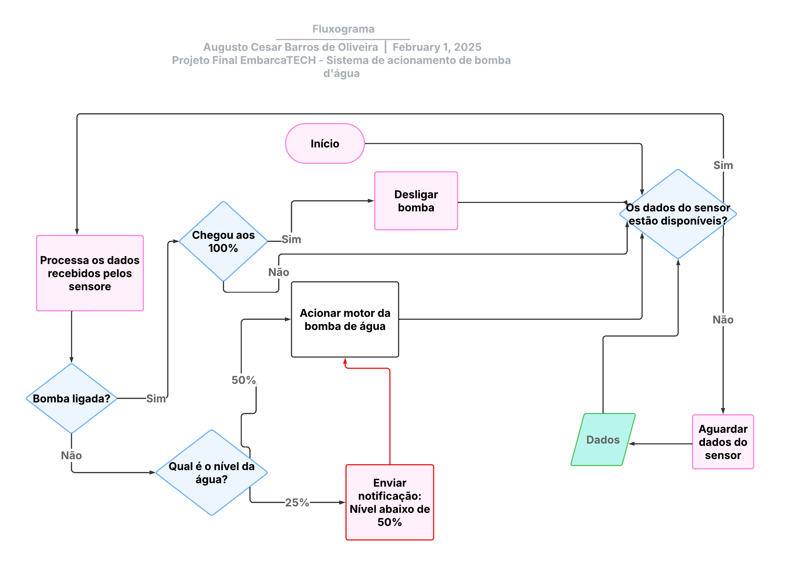

---

# 🚰 Sistema Embarcado para Controle de Bomba D'Água


Bem-vindo ao repositório do projeto **Sistema Embarcado para Controle de Bomba D'Água**! Este projeto foi desenvolvido como parte do trabalho de conclusão de curso do **EmbarcaTECH**, pelo aluno **Augusto Cesar Barros de Oliveira**, integrante do grupo **ChipFlow**.

---

## 📝 Descrição do Projeto

Este projeto consiste em um sistema embarcado que controla o acionamento automático de uma bomba d'água com base no nível de água em uma caixa d'água. O sistema monitora três níveis críticos:

1. **50% ou menos:** Aciona a bomba para encher a caixa.
2. **100%:** Desliga a bomba quando a caixa está cheia.
3. **25% ou menos:** Verifica se a condição de 50% não foi atendida e aciona a bomba novamente.

O sistema utiliza um **Raspberry Pi Pico** como microcontrolador, um **display OLED SSD1306** para exibir informações, **LEDs** para indicar status, **botões** para simulação de eventos e um **buzzer** para alertas sonoros.

---

## 🎯 Funcionalidades

- **Monitoramento do nível da água:** Utiliza um sensor analógico para medir o nível da água.
- **Controle da bomba d'água:** Aciona e desliga a bomba com base no nível da água.
- **Interface visual:** Exibe mensagens e status no display OLED.
- **Indicação por LEDs:** Usa LEDs para indicar o estado do sistema (nível crítico, bomba ligada/desligada).
- **Alertas sonoros:** Emite alertas sonoros com um buzzer em situações críticas.
- **Simulação de eventos:** Botões para simular os níveis de água (50%, 25%, 100%).

---

## 🛠️ Tecnologias e Componentes Utilizados

### Hardware
- **Microcontrolador:** Raspberry Pi Pico
- **Display:** OLED SSD1306 (128x64 pixels)
- **Sensores:** Leitura analógica do nível da água (simulado por botões)
- **LEDs:** Vermelho, Azul e Verde para indicação de status
- **Buzzer:** Para alertas sonoros
- **Botões:** Para simulação de eventos

### Software
- **Linguagem de Programação:** C
- **Bibliotecas:**
  - `pico/stdlib.h` (GPIO, temporização)
  - `hardware/adc.h` (Conversor Analógico-Digital)
  - `hardware/i2c.h` (Comunicação I2C para o display)
  - `hardware/pwm.h` (Controle do buzzer)
  - `ssd1306.h` (Driver para o display OLED)

---

## 📸 Imagens do Projeto



---

## 🚀 Como Executar o Projeto

### Pré-requisitos
- **Hardware:**
  - Raspberry Pi Pico
  - Display OLED SSD1306
  - LEDs (Vermelho, Azul, Verde)
  - Botões
  - Buzzer
  - Resistores e jumpers
- **Software:**
  - Ambiente de desenvolvimento para Raspberry Pi Pico (ex: VS Code com extensão Pico)
  - Compilador GCC para ARM
  - `cmake` e `make` para build do projeto

### Instalação
1. Clone este repositório:
   ```bash
   git clone https://github.com/seu-usuario/sistema-bomba-agua.git
   cd sistema-bomba-agua
   ```
2. Configure o ambiente de desenvolvimento para o Raspberry Pi Pico.
3. Compile o projeto:
   ```bash
   mkdir build
   cd build
   cmake ..
   make
   ```
4. Conecte o Raspberry Pi Pico ao computador e carregue o firmware gerado (`sistema-bomba-agua.uf2`).

### Execução
1. Conecte o hardware conforme o diagrama do projeto.
2. Alimente o sistema.
3. O sistema iniciará automaticamente, monitorando o nível da água e exibindo informações no display.

---

## 📂 Estrutura do Projeto

```
sistema-bomba-agua/
├── src/                                       # Código-fonte do projeto
│   ├── Projeto_Final_EmbarcaTech.c            # Arquivo principal contendo a lógica do sistema
│   ├── in/                                    # Diretório de arquivos de cabeçalho e drivers
│   │   ├── ssd1306.h                          # Cabeçalho principal do driver do display OLED
│   │   ├── ssd1306_i2c.h                      # Cabeçalho do driver de comunicação I2C do OLED
│   │   ├── ssd1306_i2c.c                      # Implementação do driver de comunicação I2C do OLED
│   │   ├── ssd1306_font.h                     # Definições das fontes usadas no display OLED
├── CMakeLists.txt                             # Arquivo de configuração do CMake para a compilação do projeto
├── README.md                                  # Documentação do projeto

```

---

## 🧩 Funcionamento do Código

### `setup()`
Inicializa todos os periféricos (GPIO, I2C, ADC, PWM). Configura os pinos dos LEDs, botões e buzzer. Inicializa o display OLED.

```c
void setup() {
    stdio_init_all();
    i2c_init(i2c1, ssd1306_i2c_clock * 1000);
    gpio_set_function(I2C_SDA, GPIO_FUNC_I2C);
    gpio_set_function(I2C_SCL, GPIO_FUNC_I2C);
    gpio_pull_up(I2C_SDA);
    gpio_pull_up(I2C_SCL);

    gpio_init(LED_PIN_VM);
    gpio_set_dir(LED_PIN_VM, GPIO_OUT);
    gpio_init(LED_PIN_AZ);
    gpio_set_dir(LED_PIN_AZ, GPIO_OUT);
    gpio_init(LED_PIN_VD);
    gpio_set_dir(LED_PIN_VD, GPIO_OUT);

    gpio_init(BTN_A);
    gpio_set_dir(BTN_A, GPIO_IN);
    gpio_pull_up(BTN_A);

    gpio_init(BTN_B);
    gpio_set_dir(BTN_B, GPIO_IN);
    gpio_pull_up(BTN_B);

    adc_init();
    adc_gpio_init(ANALOG_PIN);

    ssd1306_init();
    calculate_render_area_buffer_length(&frame_area);

    gpio_set_function(BUZZER_PIN, GPIO_FUNC_PWM);
    uint slice_num = pwm_gpio_to_slice_num(BUZZER_PIN);
    pwm_config config = pwm_get_default_config();
    pwm_config_set_clkdiv(&config, clock_get_hz(clk_sys) / (BUZZER_FREQUENCY * 4096));
    pwm_init(slice_num, &config, true);
    pwm_set_gpio_level(BUZZER_PIN, 0);

    limpa_display();
}
```

### `loop()`
Verifica o estado dos botões para simular eventos. Lê o valor do ADC para monitorar o nível da água. Aciona/desliga a bomba e exibe mensagens no display com base no nível da água.

```c
void loop() {
    while(true) {
        if (gpio_get(BTN_A) == 0) {
            while (gpio_get(BTN_A) == 0) {
                sleep_ms(10);
            }
            limpa_display();
            gpio_put(LED_PIN_VM, 1);
            gpio_put(LED_PIN_VD, 1);
            char *text[] = {
                "       50       ",
                "   Bomba Dagua   ",
                " Acionada   "
            };
            int num_linhas = sizeof(text) / sizeof(text[0]);
            imprime_texto(text, num_linhas);
            sleep_ms(3500);
            gpio_put(LED_PIN_VM, 0);
            gpio_put(LED_PIN_VD, 0);
            caixa_cheia();
            sleep_ms(3500);
            limpa_display();
            gpio_put(LED_PIN_VD, 0);
            gpio_put(LED_PIN_VM, 0);
        }

        if (gpio_get(BTN_B) == 0) {
            while (gpio_get(BTN_B) == 0) {
                sleep_ms(10);
            }
            limpa_display();
            gpio_put(LED_PIN_VM, 1);
            gpio_put(LED_PIN_VD, 0);
            gpio_put(LED_PIN_AZ, 0);
            char *text[] = {
                "                     ",
                "   25% da caixa   ",
                " Bomba   ",
                " nao acionada. "
                "  Acionado bomba   "
            };
            int num_linhas = sizeof(text) / sizeof(text[0]);
            imprime_texto(text, num_linhas);
            sleep_ms(2000);
            gpio_put(LED_PIN_VM, 0);
            caixa_cheia();
            sleep_ms(3500);
            limpa_display();
        }

        adc_select_input(0);
        uint16_t analog_value = adc_read();
        if (analog_value > THRESHOLD_ANALOG) {
            limpa_display();
            gpio_put(LED_PIN_VM, 1);
            gpio_put(LED_PIN_AZ, 0);
            gpio_put(LED_PIN_VD, 0);
            char *text[] = {
                "   25% da caixa   ",
                " Bomba  com ",
                "  Defeito  "
            };
            int num_linhas = sizeof(text) / sizeof(text[0]);
            beep(BUZZER_PIN, 500);
            imprime_texto(text, num_linhas);
            for (int i = 0; i <10; i++) {
                gpio_put(LED_PIN_VM, 1);
                sleep_ms(500);
                gpio_put(LED_PIN_VM, 0);
                sleep_ms(500);
            }
            beep(BUZZER_PIN, 500);
            sleep_ms(2500);
            limpa_display();
            gpio_put(LED_PIN_VM, 0);
        }
    }
}
```

### `beep()`
Gera alertas sonoros com o buzzer.

```c
void beep(uint pin, uint duration_ms) {
    uint slice_num = pwm_gpio_to_slice_num(pin);
    pwm_set_gpio_level(pin, 2048);
    sleep_ms(duration_ms);
    pwm_set_gpio_level(pin, 0);
    sleep_ms(100);
}
```

### `imprime_texto()`
Exibe mensagens no display OLED.

```c
void imprime_texto(char *text[], int num_linhas) {
    limpa_display();
    int y = 0;
    for (uint i = 0; i < num_linhas; i++) {
        ssd1306_draw_string(ssd, 5, y, text[i]);
        y += 8;
    }
    render_on_display(ssd, &frame_area);
}
```

---

## 📄 Licença

Este projeto é livre.

---

## 👏 Contribuição

Contribuições são bem-vindas! Siga os passos abaixo:

1. Faça um fork do projeto.
2. Crie uma branch para sua feature (`git checkout -b feature/nova-feature`).
3. Commit suas mudanças (`git commit -m 'Adiciona nova feature'`).
4. Push para a branch (`git push origin feature/nova-feature`).
5. Abra um Pull Request.

---

## 📧 Contato

**Augusto Cesar**  
- Email: [azotaugusto@gmail.com](mailto:azotaugusto@gmail.com)  
- GitHub: [@aucoliveira](https://github.com/aucoliviera)  
- LinkedIn: [Augusto de Oliviera](https://www.linkedin.com/in/augusto-cesar-devjava/)  

---

Feito com ❤️   🚀

--- 

